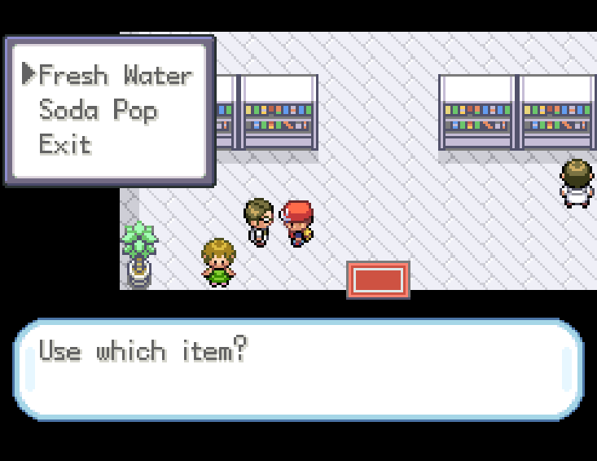
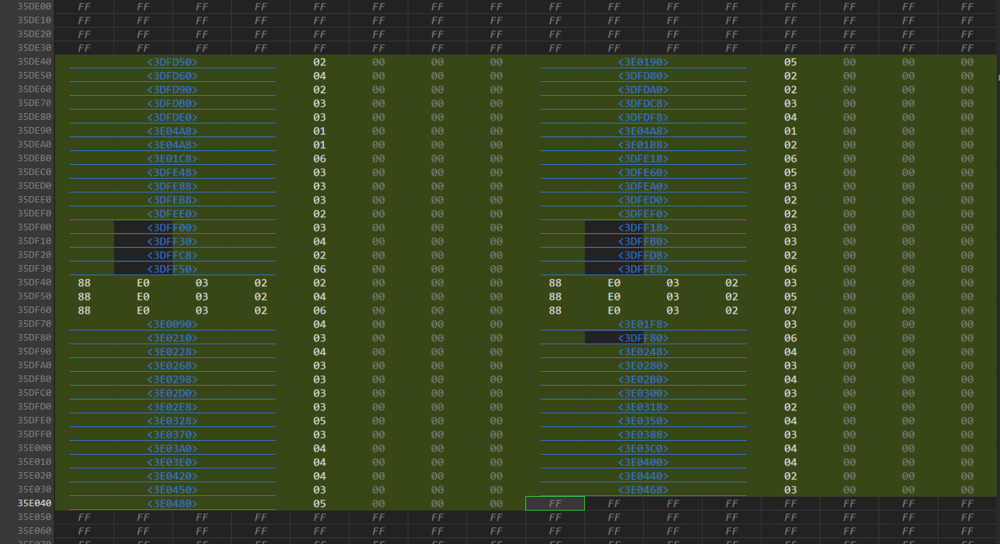
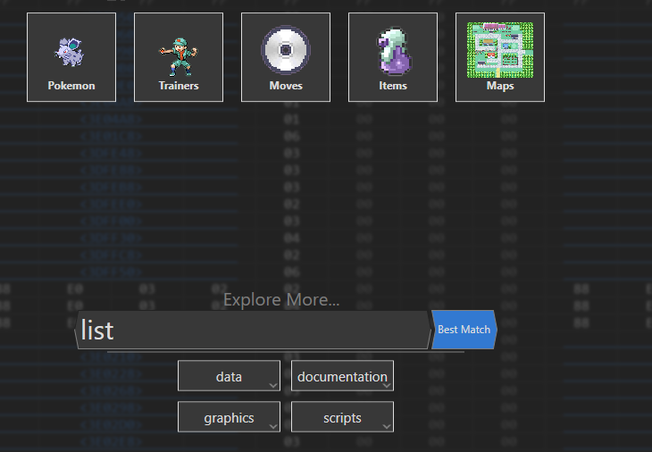
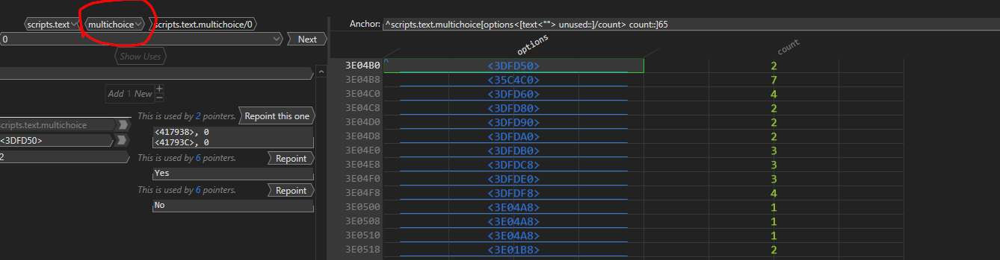
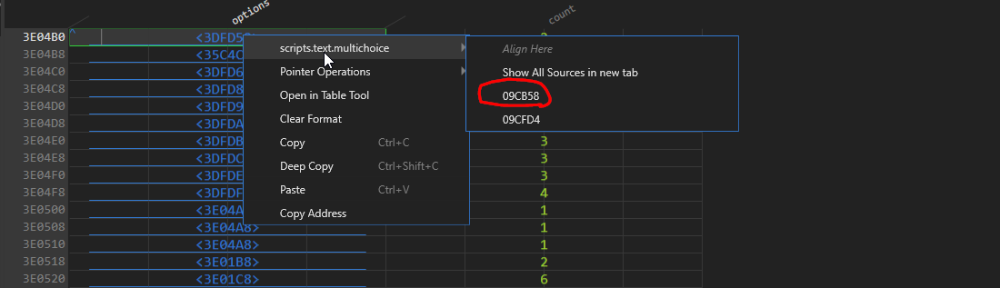
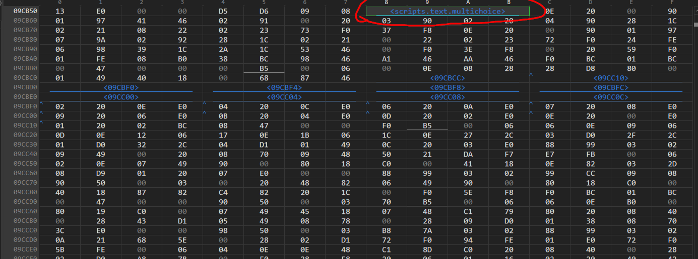
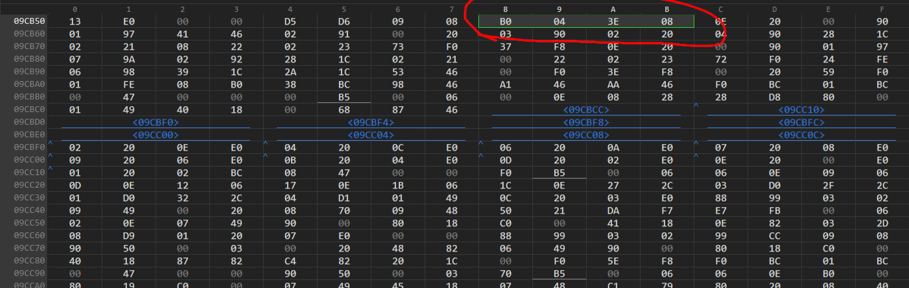
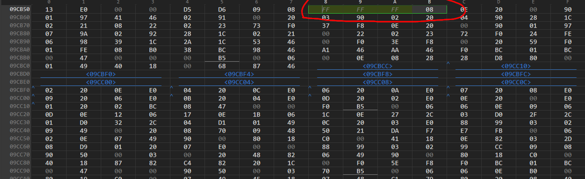
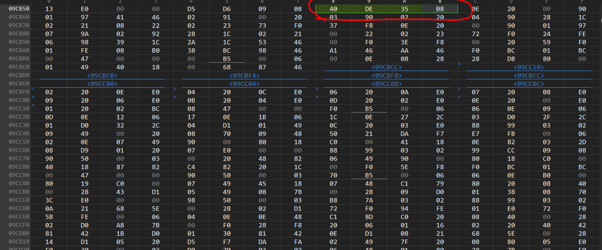
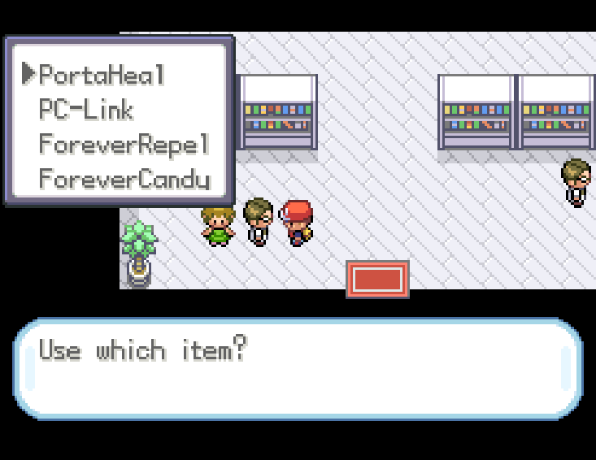

# HUBOL MultiChoice FIX -- Guide

# Fixing Multichoice List Issues in HUBOL (HexManiacAdvance)

This guide walks you through fixing multichoice list issues in HUBOL using **HexManiacAdvance (HMA)**.  
Follow the steps carefully and reference the screenshots provided.

---

## 0. The Issue at Hand
Before we begin, here’s the problem we’re aiming to fix:

---

## 1. Find Free Space
Open your HUBOL ROM in HMA and find **592 bytes of free space**.

---

## 2. Paste the Bytes
Paste the following bytes into the free space:

<3DFD50> 02 00 00 00 <3E0190> 05 00 00 00 <3DFD60> 04 00 00 00 <3DFD80> 02 00 00 00 <3DFD90> 02 00 00 00 <3DFDA0> 02 00 00 00 <3DFDB0> 03 00 00 00 <3DFDC8> 03 00 00 00 <3DFDE0> 03 00 00 00 <3DFDF8> 04 00 00 00 <3E04A8> 01 00 00 00 <3E04A8> 01 00 00 00 <3E04A8> 01 00 00 00 <3E01B8> 02 00 00 00 <3E01C8> 06 00 00 00 <3DFE18> 06 00 00 00 <3DFE48> 03 00 00 00 <3DFE60> 05 00 00 00 <3DFE88> 03 00 00 00 <3DFEA0> 03 00 00 00 <3DFEB8> 03 00 00 00 <3DFED0> 02 00 00 00 <3DFEE0> 02 00 00 00 <3DFEF0> 02 00 00 00 <3DFF00> 03 00 00 00 <3DFF18> 03 00 00 00 <3DFF30> 04 00 00 00 <3DFFB0> 03 00 00 00 <3DFFC8> 02 00 00 00 <3DFFD8> 02 00 00 00 <3DFF50> 06 00 00 00 <3DFFE8> 06 00 00 00 88 E0 03 02 02 00 00 00 88 E0 03 02 03 00 00 00 88 E0 03 02 04 00 00 00 88 E0 03 02 05 00 00 00 88 E0 03 02 06 00 00 00 88 E0 03 02 07 00 00 00 <3E0090> 04 00 00 00 <3E01F8> 03 00 00 00 <3E0210> 03 00 00 00 <3DFF80> 06 00 00 00 <3E0228> 04 00 00 00 <3E0248> 04 00 00 00 <3E0268> 03 00 00 00 <3E0280> 03 00 00 00 <3E0298> 03 00 00 00 <3E02B0> 04 00 00 00 <3E02D0> 03 00 00 00 <3E0300> 03 00 00 00 <3E02E8> 03 00 00 00 <3E0318> 02 00 00 00 <3E0328> 05 00 00 00 <3E0350> 04 00 00 00 <3E0370> 03 00 00 00 <3E0388> 03 00 00 00 <3E03A0> 04 00 00 00 <3E03C0> 04 00 00 00 <3E03E0> 04 00 00 00 <3E0400> 04 00 00 00 <3E0420> 04 00 00 00 <3E0440> 02 00 00 00 <3E0450> 03 00 00 00 <3E0468> 03 00 00 00 <3E0480> 05 00 00 00

---

## 3. Save Your Offset
Take note of your offset.  
For example: `35DE40`

---

## 4. Find the Original Multichoice List
Navigate to the original multichoice list.

  

---

## 5. Follow the Pointer
Right-click the top pointer (`multilist 0`).  
It should show `scripts.text.multichoice` with an arrow →.  
Hover over it and click the **first pointer** in the displayed list.

---

## 6. Clear the Format
Once inside, you’ll see `<scripts.text.multichoice>` in the data table.  
Right-click this pointer and select **Clear Format**.

  

---

## 7. Remove the First Three Bytes
Remove the first three bytes before the `08`.

---

## 8. Insert the Correct Offset
Now insert the saved offset in little-endian format.  
Example:  
`35DE40` → `35 DE 40` → `40 DE 35`

---

## 9. Finished
Your multichoice list should now be fixed!

---

## Notes
- Always back up your ROM before making edits.  
- Your offset will vary depending on free space—adjust accordingly.  
